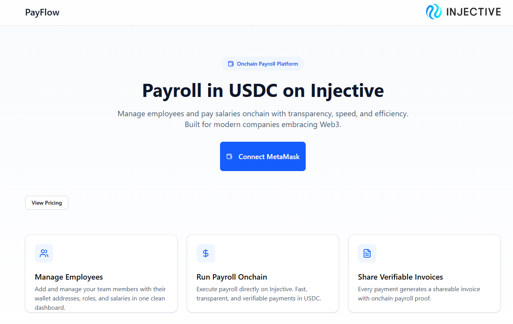
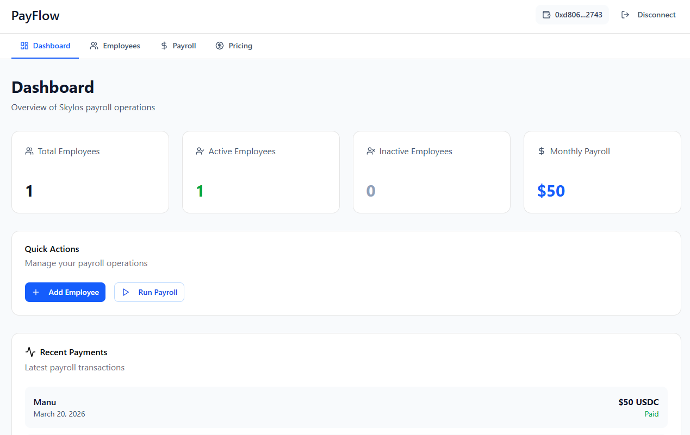
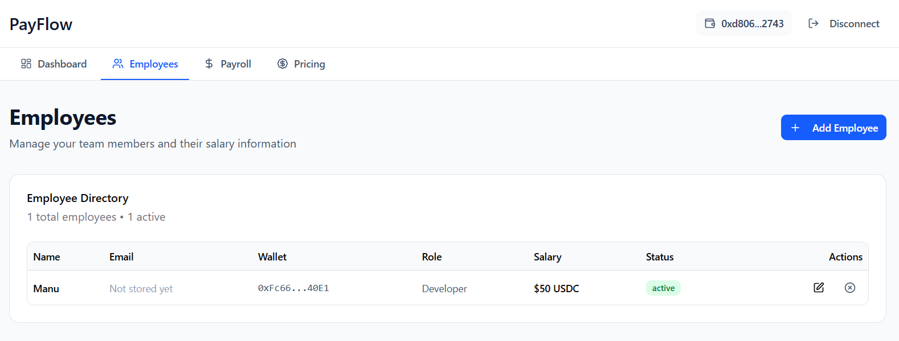
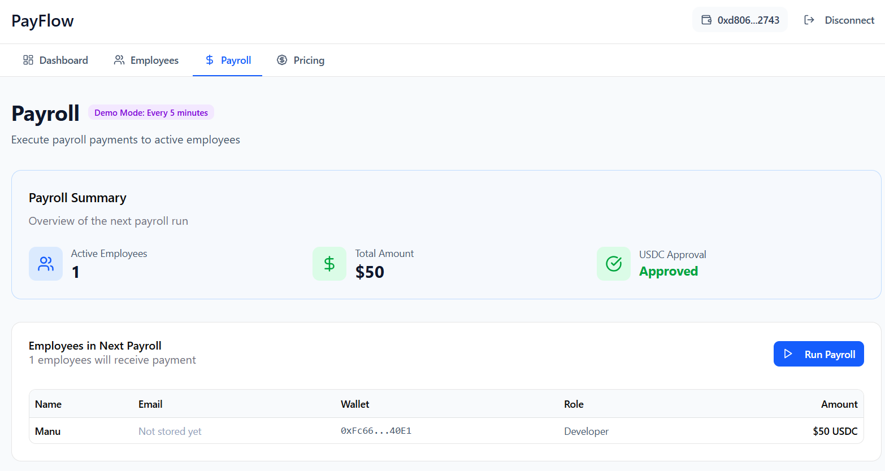
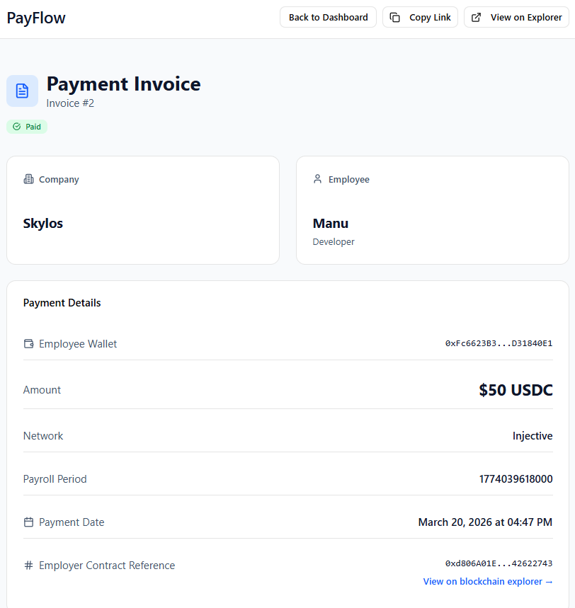
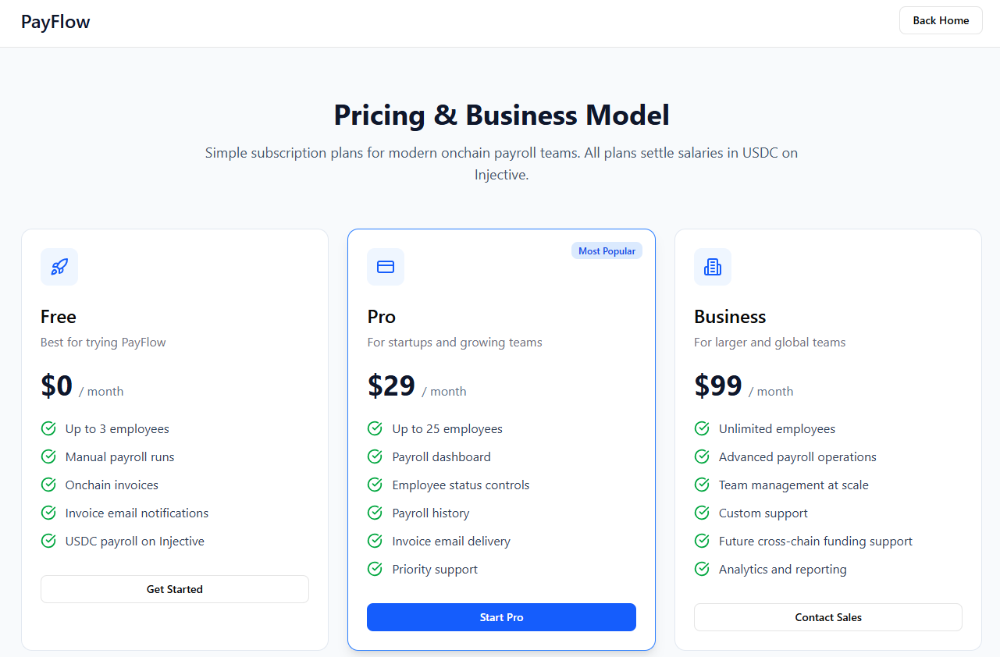
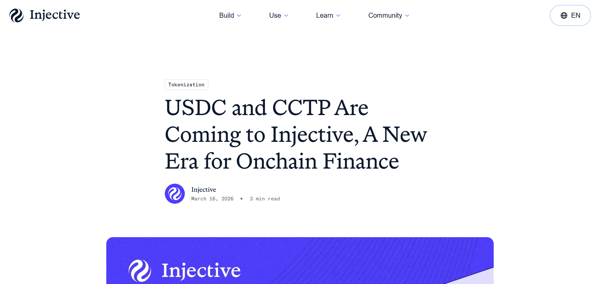

# PayFlow

## Onchain Payroll in USDC on Injective

PayFlow is an onchain payroll platform that allows companies to manage employees and execute salary payments in **USDC on Injective**. It is designed for modern teams that need a more transparent, programmable, and finance-native way to handle payroll operations.

The product enables a company to connect with MetaMask, register its company profile, approve USDC for payroll operations, add employees, define salaries, mark employees as active or inactive, run payroll through a smart contract, and generate verifiable payment invoices backed by onchain records. In parallel, a lightweight backend stores employee emails and triggers invoice notifications after payroll is executed. This creates a product experience that feels familiar from a SaaS perspective, while keeping the core financial logic onchain.

  

  

## Why PayFlow

Payroll is one of the clearest real-world use cases for programmable finance. Traditional payroll systems are often fragmented, manual, expensive for international teams, difficult to audit, and not designed around interoperable digital payment rails. PayFlow rethinks payroll as an onchain workflow where the salary settlement layer is transparent and verifiable by design.

Instead of using blockchain as an optional payment add-on, PayFlow uses blockchain where it matters most: at the level of payroll execution, payment records, and settlement. This makes the product especially relevant for startups, remote teams, DAOs, and globally distributed organizations that need a simpler way to pay contributors across borders and maintain a trustworthy record of those payments.

## Why Injective

Injective is core to PayFlow, not just integrated into it.

Injective officially positions itself as **the blockchain built for finance**, and its developer stack includes **native EVM support**, which means builders can deploy Solidity smart contracts and use familiar EVM tooling such as MetaMask and Ethereum-style workflows. That makes Injective a strong fit for an application like PayFlow, where the product itself is a financial workflow rather than a generic dApp.

PayFlow uses Injective because:

### 1. Payroll is a finance-native use case

Payroll is fundamentally about money movement, settlement, recordkeeping, and trust. Injective is built specifically for finance-oriented applications, which makes it a natural home for a payroll product rather than just a general-purpose chain.

### 2. Injective EVM makes the stack practical

Because Injective supports native EVM development, PayFlow can be built with Solidity contracts, MetaMask, and standard frontend tooling while still being deployed on infrastructure designed for financial applications. That lowers integration friction while preserving a strong product-chain fit.

### 3. Settlement happens on Injective

The core of PayFlow lives on Injective. Company registration, employee payroll state, salary values, employee status, payroll execution, and payment records are all tied to the payroll smart contract. Injective is therefore not just the network where transactions happen; it is the source of truth for the payroll logic of the application.

### 4. The future roadmap aligns directly with Injective’s direction

Injective and Circle have publicly announced that **USDC and CCTP are coming to Injective**. Circle explains that this will enable secure USDC movement between Injective and other supported chains and unlock applications involving cross-chain onboarding and liquidity flows. That is directly aligned with PayFlow’s next product direction: in the future, companies should be able to fund payroll from multiple chains while still settling salaries on Injective.

## What the Product Does Today

The current MVP demonstrates the full core payroll flow:

* company onboarding with MetaMask
* company registration onchain
* USDC approval for payroll execution
* employee creation and management
* active / inactive employment state
* salary assignment
* payroll execution through a smart contract
* onchain payment record creation
* invoice pages for each payment
* offchain invoice email notifications

The demo currently runs on **Injective EVM Testnet** and uses a USDC mock token for testing and demonstration.

## Product Flow

### 1. Wallet Connection

A company connects to PayFlow using **MetaMask**.

### 2. Company Registration

If the company does not yet exist in the payroll contract, it completes onboarding by providing:

* company name
* country
* default funding chain

This data is written onchain through the payroll contract.

### 3. USDC Approval

Before payroll can be used, the company must approve the payroll contract to spend USDC from its wallet. This enables the payroll contract to execute salary transfers when payroll is run.

### 4. Employee Management

  

The company adds employees with:

* name
* wallet address
* role
* salary
* active / inactive status

Core payroll fields are stored onchain. The employee email is stored offchain through the backend.

### 5. Payroll Execution

  

When payroll is triggered, the smart contract:

* checks which employees are active
* transfers USDC to those employees
* creates payment records
* emits payroll-related events
* stores verifiable payment data onchain

### 6. Invoice Generation

  

Each salary payment can be viewed through an invoice page in the frontend. The invoice is backed by onchain payment data retrieved from the payroll contract.

### 7. Invoice Email Notification

After payroll runs, the backend retrieves the employee email and sends an invoice notification containing the payment details and invoice link.

## Current Architecture

PayFlow is intentionally split into three layers:

### Frontend

The frontend handles:

* wallet connection
* onboarding
* USDC approval flow
* employee management UI
* payroll execution UI
* invoice pages
* pricing / business model presentation

### Contracts

The smart contracts handle:

* company registration
* employee payroll records
* salary data
* active / inactive employee state
* payroll execution
* payment creation
* invoice source data

### Backend

The backend handles:

* employee email storage
* employee email lookup
* invoice email delivery

This architecture keeps the **financial logic onchain** while keeping communication and private contact data offchain.

## Why Blockchain Is Actually Useful Here

PayFlow does not use blockchain for superficial branding. It uses blockchain because it improves the payroll product in concrete ways.

### Transparency

Every payment is recorded onchain and can be independently verified.

### Auditability

Companies and employees can reference a shared invoice page and the underlying blockchain data.

### Programmability

Payroll logic is executed by a smart contract rather than through manual, opaque, or fragmented payment workflows.

### Composability

Because the product is built on Injective EVM, it can evolve into a broader programmable finance workflow rather than remaining a closed payroll dashboard.

## Future Vision: Native USDC and CCTP

The current MVP already proves the core idea: salaries can be settled in USDC on Injective.

The next major step is the arrival of **native USDC and CCTP on Injective**, which Injective and Circle have officially announced. Circle describes this as an upgrade that will support secure USDC movement between Injective and other supported chains and enable cross-chain onboarding and liquidity use cases.

That future unlocks the longer-term version of PayFlow:

* a company funds payroll from another supported chain in USDC
* funds move into Injective through CCTP
* payroll still executes and settles on Injective
* employees still receive salaries on Injective
* Injective remains the settlement and payroll record layer

In one sentence:

**Fund anywhere. Settle payroll on Injective.**

That is the product direction PayFlow is built toward.

## Business Model

PayFlow is designed as a subscription-based SaaS payroll product.

  

### Free

For small teams testing onchain payroll.

* up to 3 employees
* manual payroll runs
* onchain invoices
* email notifications
* USDC settlement on Injective

### Pro

For startups and growing teams.

* up to 25 employees
* payroll dashboard
* employee management
* invoice email delivery
* payroll history
* priority support

### Business

For larger and global teams.

* unlimited employees
* advanced payroll operations
* higher-scale team management
* future cross-chain funding support
* analytics and reporting
* custom support

This model fits the product because payroll creates recurring operational value, not just one-time usage.

## What Makes PayFlow Compelling

PayFlow is compelling because it takes a concrete financial workflow and maps it directly onto blockchain infrastructure in a way that is understandable, testable, and extensible.

It is not a vague DeFi experiment. It is a product-oriented payroll MVP with:

* a clear user
* a clear workflow
* a clear reason for using Injective
* a clear future direction once native USDC and CCTP are available

That combination makes it both realistic as a product and strong as a blockchain use case.

## Repository Structure

This repository is divided into three main parts, each with its own dedicated README for deeper technical detail:

* **Frontend README**
  Explains the UI flow, pages, wallet integration, and frontend stack.

* **Backend README**
  Explains employee email storage, invoice email delivery, Supabase, and Resend.

* **Contracts README**
  Explains the payroll smart contract, employee records, payment execution, and onchain logic.

This top-level README is the full project overview, while each sub-README explains its own layer in more detail.

## Conclusion

PayFlow is an onchain payroll MVP built around a simple but powerful idea:

**Companies should be able to manage employees and pay salaries in USDC on Injective, with payroll records that are transparent, verifiable, and programmable.**

Injective is the right chain for this because it is built for finance, supports native EVM development, and is directly moving toward native USDC and CCTP support, which matches PayFlow’s long-term roadmap for cross-chain payroll funding and Injective-native settlement.

  

